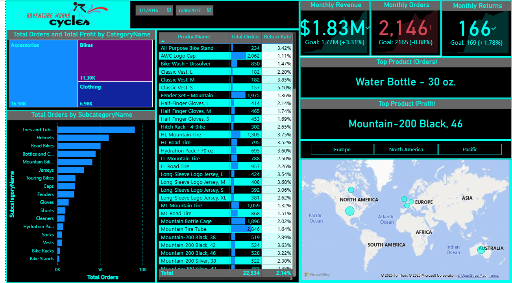

# AdventureWorks Power BI Dashboard

This project simulates a real-world Business Intelligence workflow for *AdventureWorks Cycles*, a fictional multinational manufacturing company. As a Business Intelligence Analyst, I built an interactive Power BI solution that provides executive-level insights into sales performance, customer behavior, and product trends across various regions.

---

## 🔧 Tools & Technologies Used
- *Power BI Desktop*
- *Power Query* (ETL process)
- *DAX* (KPIs, calculated columns, time intelligence)
- *Star Schema* (Data Modeling)
- *Excel* (Raw data source)

---

## 🗂 Data Overview
- Over *100,000+ rows* of sales and customer data
- Tables include:
  - Sales Transactions
  - Customer Information
  - Products & Categories
  - Regional Mapping

---

## 📊 Key Dashboards & Insights
- *KPI Dashboard*: Revenue, Profit, Orders, Avg. Order Value
- *Regional Analysis*: Sales performance across North America, Pacific and Europe
- *Product Trends*: Top categories, best-selling products

> All dashboards are interactive, with slicers, drill-downs, and bookmarks for intuitive exploration.

---

## 📁 Project Files
- AdventureWorks.pbix — Final Power BI report
- AdventureWorks CSV Files.zip — Folder containing all raw Excel data files (e.g., Customers, Sales, Products)
---

## EXEC Dashboard

---

## 💡 What I Learned
- Full BI workflow from data extraction to dashboard delivery
- Writing effective DAX measures for dynamic KPIs and filters
- Modeling normalized data using star schema for better performance
- Designing user-friendly, interactive dashboards aligned with business goals

---

## 🚀 How to Use
1. Clone or download the repository
2. Open the .pbix file in *Power BI Desktop*
3. Explore the reports and customize filters as needed

---
